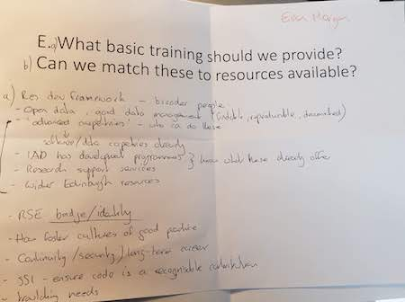

# Ice breaking Session
Participants were asked:

* Five volunteers
   * Act as a facilitator/scribe/reporter.
* Pick 1 of 5 break out points.
   * Want 5 to 6 people per group.
   * Pick  a group where you know the least number of people.
* Spend 1 minute/person telling the others in your group who you are.
* Open envelope and answer the question contained therein (10mins).
   * Facilitator to moderate conversation AND take notes on piece of paper.
   * Summarise answers
* Report back to everyone (1 min/group).

# Topics and responses

## A. What groups should CERSE target first and why?

> It was concluded that all of these areas were important.

## B. What 5 topics do you think this community would like to be presented on at a future CERSE meeting in ranking order?

> Group changed the nature of the question as to what would draw people in. Cake was thought to be an important factor. A couple of other suggestions were also made such as quizzes.

## C. Scheduling these meetings to maximise diversity and attendance

* How regular should these meetings be held? 
   * Weekly? Monthly? bi-monthly? more often? less often?
* Should we fix a day or move the day for meetings?
* What would be the best time in the day and for how long should the meetings run?

> * It was thought that bi-monthly meetings would be good.
> * That the meeting time and day should be moved around as should the time.
> * Two hours was the right frequency.

## D. Realistically, can we cater for all RSEs in Edinburgh?

* Should we try to host meetings in other Edinburgh Universities/Companies or establish a franchise?

> Sadly this group did not make notes on the sheet 
> of paper so if a member from this group can provide 
> a summary then that would be good.

## E. What basic training should we provide? Can we match these to resources available?

> * Regarding a development framework
>   * broaden people's knowledge
>   * open data, good data managment (findable, reproducible, documented)
>   * advanced carpentries - who can do these
>       * Have software/data carpentries already
>   * IAD has developed programmes - know what theese already offer
>   * wider Edinburgh resources
>   * RSE badge/identity
>   * How to foster cultures of good practice
>   * Continuity/security/log-term career
>   * SSI - ensure code is a recognisable contribitution
>   * ? needs
